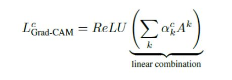

# Grad-CAM
Pytorch and Keras implementation of [Grad-CAM](https://arxiv.org/abs/1610.02391), simple to use with any CNN based architecture.

  

## Overview
Deep neural models based on Convolutional Neural Networks (CNNs) have enabled unprecedented breakthroughs
in a variety of computer vision tasks, image classification, object detection, image segmentation, image captioning and more. While these models enable superior performance, they considered to be a black boxes and hard to interpret.

**Why interpretability matters?**
>In order to build trust in intelligent
systems and move towards their meaningful integration into our everyday lives, it is clear that we must build ‘transparent’ models that have the ability to explain why they predict what they predict.

## APPROACH
Gradient-weighted Class Activation Mapping
(Grad-CAM), uses the gradients of any target concept (say
‘dog’ in a classification network or a sequence of words
in captioning network) flowing into the final convolutional
layer to produce a coarse localization map highlighting the
important regions in the image for predicting the concept.

To obtain the class discriminative localization map of width u and height v for any class c, we first compute the gradient of the score for the class c, yc (before the softmax) with respect to feature maps Ak of a convolutional layer.

  

After calculating ak for the target class c, we perform a weighted combination of activation maps and follow it by ReLU.

  

## How to use?

Follow this [IPython](Grad_CAM_demo.ipynb) notebook for more demonstration.

### References
* [Grad-CAM: Visual Explanations from Deep Networks via Gradient-based Localization](https://arxiv.org/abs/1610.02391)
* [Understanding Hooks in PyTorch](https://blog.paperspace.com/pytorch-hooks-gradient-clipping-debugging/)
